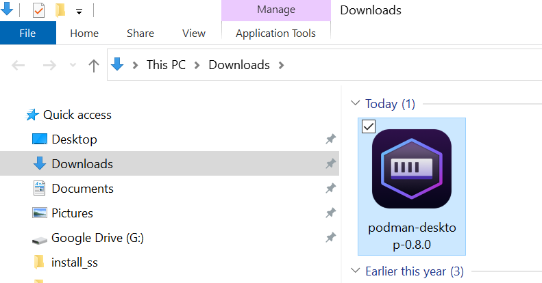
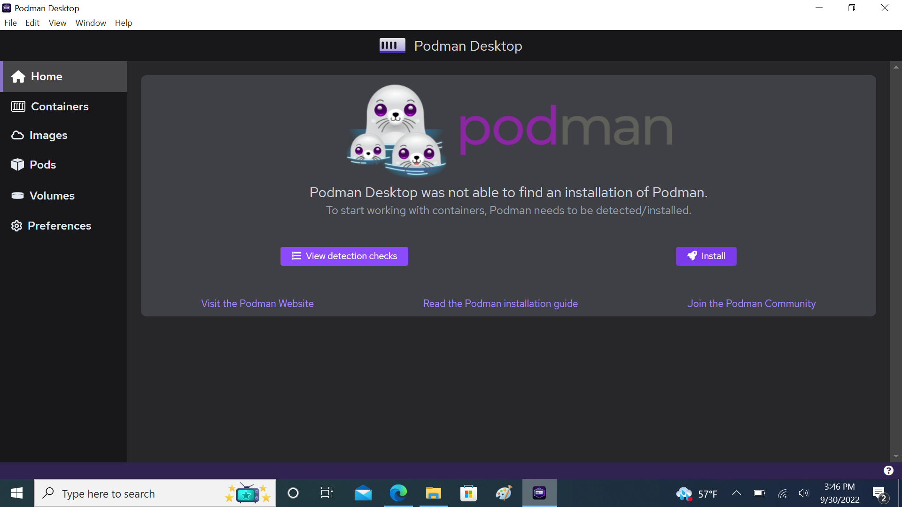

# Windows

This page contains information regarding installation of Podman Desktop on Windows.

:::infoPrerequisites:
**NOTE: Administrator access is required for both these prerequisites.**
1. [Hyper-V should be enabled](https://learn.microsoft.com/en-us/virtualization/hyper-v-on-windows/quick-start/enable-hyper-v)
2. [Windows Subsystem for Linux v2 (WSL2)](https://learn.microsoft.com/en-us/windows/wsl/install-manual) should be installed.
:::

## Installing Podman Desktop on Windows

### a. Using `.exe` file from [Downloads](/downloads/windows)

**1. Download the latest `.exe` file from the [Downloads](/downloads/windows) section of this website.**

**2. Locate the downloaded file and and double-click on it to open Podman Desktop. (Usually, you will find the downloaded file in the Downloads folder)**



### b. Using [Chocolatey](https://chocolatey.org/install) package manager for Windows

**1. Using the installation guide [here](https://chocolatey.org/install), install Chocolatey Package Manager.**

**2. To install Podman Desktop, run the following command from the command line or from PowerShell:**
```sh
choco install podman-desktop
```

**Read more about Podman Desktop on Chocolatey [here](https://community.chocolatey.org/packages/podman-desktop).**

### c. Using [Winget](https://winget.run/pkg/RedHat/Podman-Desktop) package manager for Windows

**1. Get the Winget Package manager for Windows by clicking [here](https://aka.ms/getwinget).**

**2. To install Podman Desktop, run the following command from the command line or from PowerShell:**
```sh
winget install -e --id RedHat.Podman-Desktop
```

### d. Using [Scoop](https://scoop.sh/#/apps?q=podman-desktop&s=0&d=1&o=true) package manager for Windows

**1. Using the installation guide [here](https://github.com/ScoopInstaller/Install#readme), install Scoop Package Manager.**

**2. To install Podman Desktop, run the following commands from the command line or from PowerShell:**
```sh
scoop bucket add extras
```

```sh
scoop install podman-desktop
```

## Setting up Podman Desktop on Windows

**1. Install Podman from Podman Desktop, if not yet installed.**

When you open Podman Desktop, your home screen would look like the one in the image below if you don't have Podman (Engine) installed.



**a. To install Podman, click on the `Install` button on the home screen. This will check for all the requirements for installation of Podman Engine.**


**b. If you do not have WSL2 installed, follow the instructions [here](https://learn.microsoft.com/en-us/windows/wsl/install-manual) to install the same.**

**c. Once all the requirements are met, Podman Desktop will ask you to allow installation of Podman (Engine). Click on `Yes` to continue.**


**2. Once installation is completed, you are ready to use Podman Desktop.**

After the installation of Podman Engine, your home screen would like the one in the image below.


If the screen says `Podman is installed but not ready`, it means that installation of Podman Engine has been completed but a Podman Machine has not been initialized. 

## Next Steps

You can learn more about initializing a Podman Machine and working with Podman Desktop in our [Getting Started guide](/docs/getting-started/getting-started).